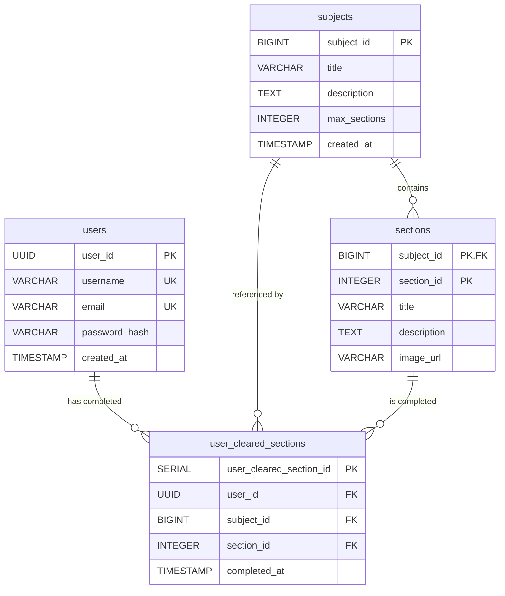

# J15 Backend

Spring Boot 3.2 + Kotlin によるバックエンドアプリケーション。オニオンアーキテクチャを採用しています。

## アーキテクチャ

このプロジェクトは**オニオンアーキテクチャ**を採用しています。

### レイヤー構成（内側から外側へ）

1. **Domain（ドメイン層）** - エンティティ、値オブジェクト、ドメインサービス
2. **Application（アプリケーション層）** - ユースケース、アプリケーションサービス
3. **Infrastructure（インフラストラクチャ層）** - リポジトリ実装、外部サービス連携
4. **Presentation（プレゼンテーション層）** - Controller、API エンドポイント

## 技術スタック

- **言語**: Kotlin 1.9.21
- **フレームワーク**: Spring Boot 3.2.0
- **JDK**: Java 17
- **データベース**: PostgreSQL 16
- **ビルドツール**: Gradle 8.5
- **マイグレーション**: Flyway
- **セキュリティ**: Spring Security
- **コンテナ**: Docker, Docker Compose

## セットアップ

### 前提条件

- Docker & Docker Compose
- Java 17 以上（ローカルビルド時）

### 環境構築

1. リポジトリをクローン

```bash
git clone https://github.com/J15team/Backend.git
cd backend
```

1. Docker Compose で起動

```bash
docker-compose up -d
```

アプリケーションは `http://localhost:8080` で起動します。

1. 動作確認

```bash
curl http://localhost:8080/api/health
```

### ローカルビルド

```bash
./gradlew build
```

### テスト

テストは Docker Compose 環境での E2E テストのみ実行されます。

```bash
# アプリケーションを起動
docker-compose up -d

# APIの動作確認
curl http://localhost:8080/api/health
curl http://localhost:8080/api/sections
```

CI/CD では GitHub Actions で自動的に E2E テストが実行されます。

## API エンドポイント

API ドキュメント:

- [API クイックリファレンス](./docs/API_quick_reference.md)
- [詳細ドキュメント (docs/detailed/)](./docs/detailed/)

### 概要

- **認証 API**: サインアップ、サインイン
- **セクション API**: セクション一覧取得、セクション詳細取得
- **進捗管理 API**: 進捗状態取得、セクション完了マーク、完了状態チェック、完了削除
- **ヘルスチェック API**: アプリケーション稼働状態確認

### 主要エンドポイント一覧

| カテゴリ   | メソッド | エンドポイント                                   | 説明                                     |
| ---------- | -------- | ------------------------------------------------ | ---------------------------------------- |
| 認証       | POST     | `/api/auth/signup`                               | 新規ユーザー登録                         |
| 認証       | POST     | `/api/auth/signin`                               | ログイン                                 |
| 題材       | GET      | `/api/subjects`                                  | 題材一覧取得                             |
| 題材       | GET      | `/api/subjects/{subjectId}`                      | 題材詳細取得                             |
| 題材       | POST     | `/api/subjects`                                  | 題材作成 (Admin)                         |
| 題材       | PUT      | `/api/subjects/{subjectId}`                      | 題材更新 (Admin)                         |
| 題材       | DELETE   | `/api/subjects/{subjectId}`                      | 題材削除 (Admin)                         |
| セクション | POST     | `/api/subjects/{subjectId}/sections`             | セクション作成・画像アップロード (Admin) |
| セクション | GET      | `/api/subjects/{subjectId}/sections`             | セクション一覧                           |
| セクション | GET      | `/api/subjects/{subjectId}/sections/{sectionId}` | セクション詳細                           |
| セクション | PUT      | `/api/subjects/{subjectId}/sections/{sectionId}` | セクション更新・画像アップロード (Admin) |
| セクション | DELETE   | `/api/subjects/{subjectId}/sections/{sectionId}` | セクション削除 (Admin)                   |
| 進捗       | GET      | `/api/progress/subjects/{subjectId}`             | 進捗取得                                 |
| 進捗       | POST     | `/api/progress/subjects/{subjectId}/sections`    | セクション完了マーク                     |
| 管理者     | POST     | `/api/admin/users`                               | 管理者作成                               |
| 管理者     | GET      | `/api/admin/users`                               | 管理者一覧取得                           |
| 管理者     | GET      | `/api/admin/users/{userId}`                      | 管理者詳細取得                           |
| 管理者     | PUT      | `/api/admin/users/{userId}`                      | 管理者更新                               |
| 管理者     | DELETE   | `/api/admin/users/{userId}`                      | 管理者削除                               |

※ セクション作成・更新時は `multipart/form-data` で画像アップロードが可能です。
詳細な仕様は [API クイックリファレンス](./docs/API_quick_reference.md) を参照してください。

### クイックスタート例

#### サインアップ

```bash
curl -X POST http://localhost:8080/api/auth/signup \
  -H "Content-Type: application/json" \
  -d '{
    "username": "testuser",
    "email": "test@example.com",
    "password": "password123"
  }'
```

#### サインイン

```bash
curl -X POST http://localhost:8080/api/auth/signin \
  -H "Content-Type: application/json" \
  -d '{
    "email": "test@example.com",
    "password": "password123"
  }'
```

#### 題材一覧取得

```bash
curl http://localhost:8080/api/subjects
```

#### セクション一覧取得

```bash
curl http://localhost:8080/api/subjects/1/sections
```

#### 進捗状態取得 (要認証)

```bash
# サインインで取得したアクセストークンを使用
curl -H "Authorization: Bearer <ACCESS_TOKEN>" \
  http://localhost:8080/api/progress/subjects/1
```

詳細なリクエスト/レスポンス形式、エラーハンドリング、バリデーションルールは [API クイックリファレンス](./docs/API_quick_reference.md) および [詳細ドキュメント](./docs/detailed/) を参照してください。

## データベース設計

### マイグレーション

Flyway を使用してデータベースマイグレーションを管理しています。(ローカルと GithubActions のみ)
本番環境は AWS RDS を使用しています。

マイグレーションファイルは `src/main/resources/db/migration/` に配置されています。

- `V1__create_users_table.sql` - ユーザーテーブルの作成
- `V2__create_sections_and_progress_tables.sql` - セクションと進捗管理テーブルの作成

### ER 図



## 開発ガイドライン

#### レート制限

API は**レート制限機能**を実装しており、DDOS 攻撃などの連続したアクセスから保護されています。

**デフォルト設定:**

- **制限**: 60 秒あたり 100 リクエスト（IP アドレス単位）
- **超過時**: HTTP 429 (Too Many Requests) を返す
- **ヘッダー**:
  - `X-RateLimit-Limit`: 制限値
  - `X-RateLimit-Remaining`: 残りリクエスト数

**設定のカスタマイズ:**

`application.yml` で設定を変更できます：

```yaml
rate-limit:
  enabled: true # レート制限の有効/無効
  capacity: 100 # 最大リクエスト数
  refill-tokens: 100 # 補充するトークン数
  refill-period-seconds: 60 # 補充間隔（秒）
  max-cache-size: 10000 # キャッシュする最大IPアドレス数
```

**注意事項:**

- プロキシ経由のアクセスでは `X-Forwarded-For` ヘッダーを使用して IP アドレスを判定します
- 本番環境では信頼できるプロキシのみを使用することを推奨します

### ブランチ戦略

- `main` - プロダクション環境
- `develop` - 開発環境（今後導入予定）
- `feature/*` - 機能開発ブランチ

### CI/CD

GitHub Actions を使用して CI/CD パイプラインを構築しています。

- **トリガー**: `main`, `develop` へのプッシュ、全ての Pull Request
- **テスト**: Docker Compose を使用した E2E テスト

## ディレクトリ構造

```text
src/
├── main/
│   ├── kotlin/
│   │   └── com/j15/backend/
│   │       ├── BackendApplication.kt
│   │       ├── domain/              # ドメイン層
│   │       │   ├── model/
│   │       │   │   ├── user/        # ユーザー関連モデル
│   │       │   │   ├── subject/     # 題材・セクション関連モデル
│   │       │   │   └── progress/    # 進捗管理モデル
│   │       │   ├── repository/
│   │       │   └── service/
│   │       ├── application/         # アプリケーション層
│   │       │   └── usecase/
│   │       ├── infrastructure/      # インフラ層
│   │       │   ├── config/
│   │       │   ├── persistence/
│   │       │   │   ├── entity/
│   │       │   │   ├── jpa/
│   │       │   │   ├── repository/
│   │       │   │   └── converter/
│   │       │   └── service/
│   │       └── presentation/        # プレゼンテーション層
│   │           ├── controller/
│   │           │   ├── admin/       # 管理者用
│   │           │   ├── auth/        # 認証用
│   │           │   ├── health/      # ヘルスチェック
│   │           │   ├── progress/    # 進捗管理
│   │           │   └── subject/     # 題材・セクション管理
│   │           ├── dto/
│   │           │   ├── request/
│   │           │   └── response/
│   │           └── exception/
│   └── resources/
│       ├── application.yml
│       └── db/migration/
└── .github/
    └── workflows/
        └── ci.yml                   # E2Eテスト定義
```

## AWS 開発環境の管理

開発環境（RDS + ECS）の起動/停止スクリプトを用意しています。コスト節約のため、使用しない時は停止してください。

```bash
# 起動（RDS + ECS + API Gateway更新）
./scripts/aws-dev.sh start

# 停止（RDS + ECS）
./scripts/aws-dev.sh stop

# 状態確認
./scripts/aws-dev.sh status
```

**本番 URL**: `https://zu9mkxoir4.execute-api.ap-northeast-1.amazonaws.com`

**注意**: RDS は停止後 7 日で自動再起動されます。長期間使用しない場合は定期的に停止してください。

## トラブルシューティング

### Docker コンテナが起動しない

```bash
docker-compose down -v
docker-compose up -d
```

### データベース接続エラー

`docker-compose.yml` の環境変数と `application.yml` の設定が一致しているか確認してください。

### ポートが既に使用されている

8080 ポートが使用中の場合は、`docker-compose.yml` のポート設定を変更してください。

## ライセンス

TBD
